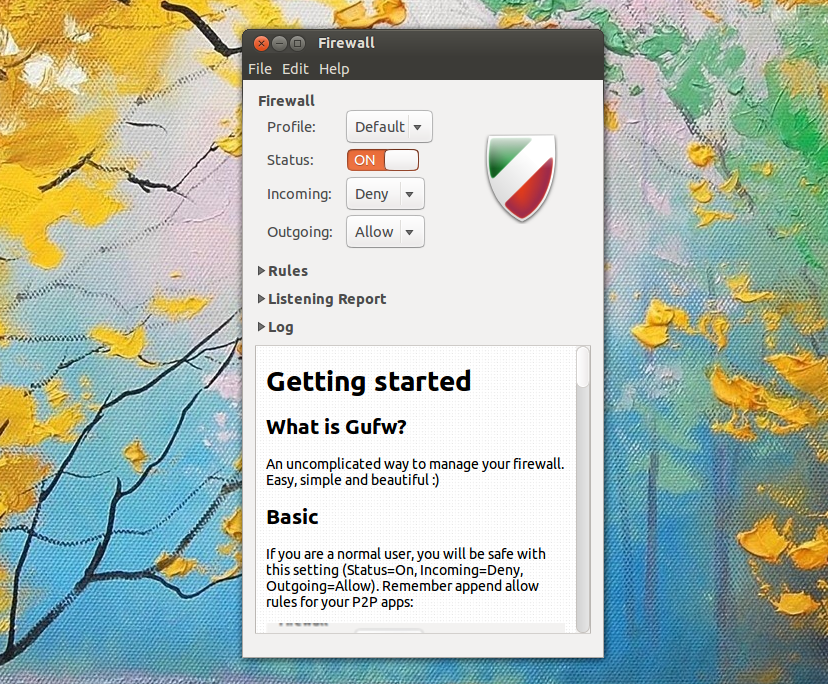

        

## Gufw
Gufw is a graphical front-end application to manage the Uncomplicated Firewall (UFW) in Linux. Gufw is mainly developed to install and configure firewall for Linux desktops.

## Source Code
This source code is available to everyone under the standard [GNU license][gnu_license].  
Gufw: [Source Code][source_code]
<!--Links-->
[source_code]: https://github.com/costales/gufw
[gnu_license]: https://github.com/costales/gufw/blob/master/COPYING.GPL3
